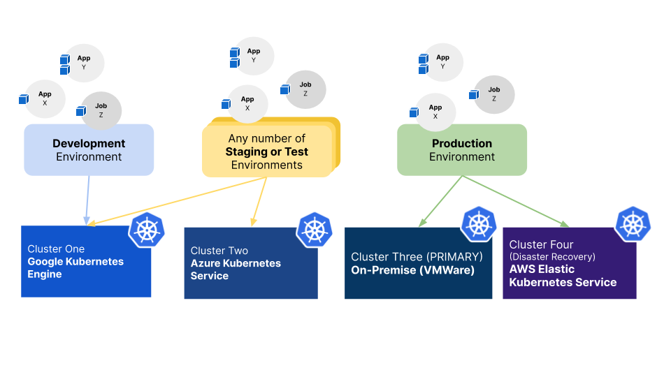

## Introduction to the Platformer Console Resource Hierachy

The following diagram depicts the high-level resources and their relationships in the Platformer Console.
 

## Environments and Kubernetes Clusters

Platformer allows multiple Kubernetes Clusters to be *associated* to an Environment.

This allows you to build highly resilient and resource-efficient solutions utilizing multiple clusters. Platformer console handles the synchronization of your applications and workloads between associated Clusters in an Environment, making multi-cluster deployments possible with a click of a button.

The following image depicts such an example, with multiple clusters associated to different Environments. 

> Note that it's not necessary to use a different Cluster per Environment as you can create multiple Environments on the same Cluster. The following diagram is only an example of one setup and your application architecture may require a different configuration entirely.

