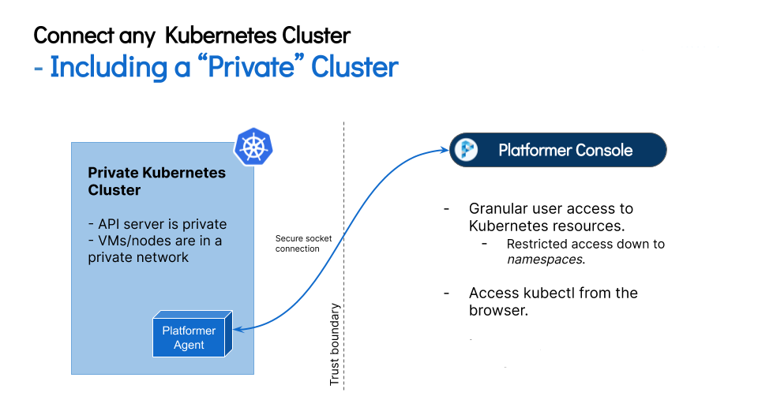

## Introduction to Kubernetes

Kubernetes (k8s) is an open-source system for automating deployment, scaling, and management of containerized applications.

It groups containers that make up an application into logical units for easy management and discovery.
Kubernetes builds upon 15 years of experience of running production workloads at Google, combined with best-of-breed ideas and practices from the community.

[Read more (Source)](https://kubernetes.io)

Kubernetes can be run on baremetal, Virtual Machines (VMWare, KVM, etc. or on public cloud provided VM services such as AWS EC2, Google GCE, Azure VMs etc.) OR even on a Raspberry Pi. Managed Kubernetes services from cloud providers (GKE, AKS, EKS, etc.) provide Kubernetes clusters with most internals managed out-of-the-box.

## Understanding how the Platformer Console connects to Kubernetes Clusters

Platformer Console allows you to add an existing Kubernetes cluster from any on-premise, private cloud, public cloud where Kubernetes is running provided the Kubernetes cluster can access the internet if you are using Platformer Console Public PaaS.

For a dedicated installation of Platformer Console in a private environment, connected clusters must be able to reach the Platformer Console APIs through the private network.

> **Platformer Console does NOT create or manage the underlying infrastructure** (which includes creating, managing and updating Kubernetes clusters). The Console handles application deployment and management on top of *any* connected Kubernetes Cluster.
>
> The Console can be run side-by-side with any Kubernetes infrastructure management service (Rancher, Anthos, etc.)

### In-Cluster Agent

When connecting a Kubernetes cluster to the Platformer Console, an *Agent* pod will be deployed to the Cluster. This `platformer-agent` pod will create a secure, long-lived connection to the Platformer APIs allowing your teams to access and manage applications on the Cluster.

This connection does not require opening any NodePorts or creating Load Balancers in the connected Cluster.

